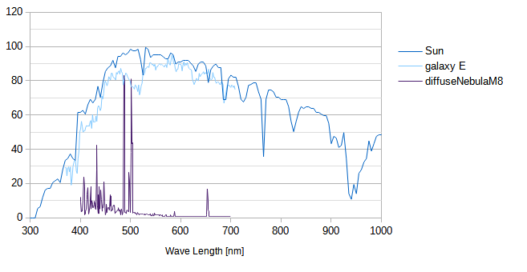
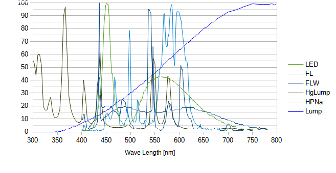
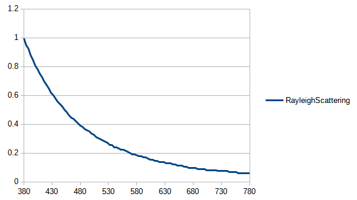
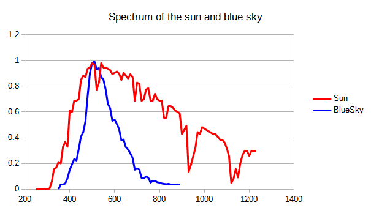
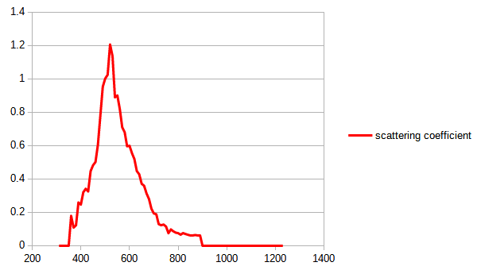
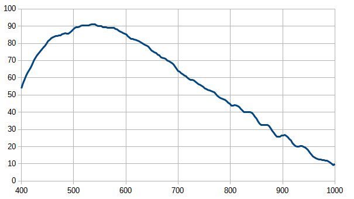
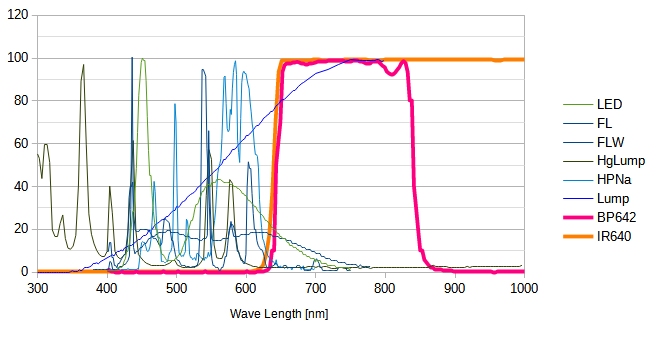
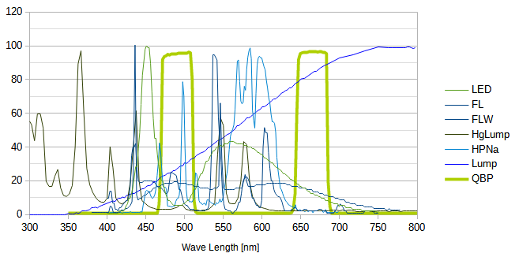

# Mechanism of light pollution reduction effect by red to near-infrared filters

## Spectrum of galaxies
The following graph shows the spectra of an elliptical galaxy, the Sun, and the diffuse nebula (M8).

While diffuse nebulae have distinct emission lines, the spectrum of a galaxy is essentially a continuous spectrum similar to that of the Sun.
Even if the H-alpha narrow-band filter is capable of anti-light pollution, it would be ineffective because it would throw away a lot of light from the galaxy.

## Spectrum of various lights

The following graph shows the spectrum of a commonly used lighting devices (lamps).

_Note: HPNa is a high-pressure sodium lamp and Lump is incandescent bulb_

Of these, the incandescent bulb is rapidly disappearing today due to its lack of efficiency. And except for incandescent bulbs, the infrared spectrum is not as pronounced.

## Sky glow from scattered light from street lamps

As long as the telescope is not facing the source of lightings,the light pollution that the telescope's field of view suffers is basically due to the scattering of the lighting, namely skyglow.

It should be noted that the **lightings are not a direct result of light pollution** when imaging celestial objects with a telescope. We need to explore the nature of the scattered light from lightings.

According to the [wikipedia description of skyglow](https://en.wikipedia.org/wiki/Skyglow), [Rayleigh Scattering](https://en.wikipedia.org/wiki/Rayleigh_scattering) may be the cause, and the light pollution may be as much at shorter wavelengths as the reason why the sky is blue.

The wavelength dependence of Rayleigh scattering is shown in the figure below.

And, the following graph shows the spectrum of normalized sunlight and blue sky. The spectrum of the blue sky attenuates at wavelengths shorter than the peak of around 500 nm, which seems to be difficult to explain by Rayleigh scattering alone, but at least the longer wavelengths are greatly attenuated.

Obviously, the blue sky has brightness due to the scattering of light from the sun, which is the light source. That is, by comparing these two spectra, we can infer the actual scattering of light by the atmosphere. First, from this graph, it can be inferred that the scattered light of long wavelengths rapidly decays after peaking around 500nm.

Based on the two data in the graph above, the following graph shows the spectrum of blue sky divided by the spectrum of the sun as the denominator. It is rough, but it may be easier to guess the wavelength dependence of the light scattered by the atmosphere on the light source.

From these graphs, we can estimate some of the characteristics of the skyglow spectrum in relation to the spectrum of the light source of light pollution. That is, the longer the wavelength, the less skyglow there is.

And, [the research described in this slides](http://darkskyparks.splet.arnes.si/files/2010/09/Lastovo2010_Andreic.pdf) also suggests that the longer the wavelength, the less susceptible the telescope is to light pollution from scattering.

*Note: This would indicate that [red to near-infrared is useful even for galaxy imaging on moonlit nights](galaxyImagingOnMoonlit.md).*

## Quantum Efficiency (QE) of CMOS Imager in Recent Years

This graph shows the absolute QE of the relatively recent SONY's [backside illumination (BSI)](https://en.wikipedia.org/wiki/Back-illuminated_sensor) monochrome CMOS image sensor (IMX455ALK) from [QHY's report](https://www.facebook.com/QHYCCD/posts/3087967891306473), which has a practical QE of about 80% even in the H-alpha band and about 40% at 800nm, indicating that imaging in the red to near-infrared is realistic. So, monochrome CMOS imagers using SONY's BSI sensors seem to have good sensitivity in red to IR.

The QE of various sensors is mentioned in [the forum of astrosurf.com](http://www.astrosurf.com/topic/139598-nouvelle-cam%C3%A9ra-mono-zwo-asi294-en-pr%C3%A9vision/?do=findComment&comment=1910295).

## IR pass filters

There are many IR pass filters on the market that are readily available to amateur astronomers. These include the classic dye-based filters and the sharper dielectric interference filters.

The author has been attempting to image galaxies using the [ProPlanet 642 BP IR-pass filter](https://www.astronomik.com/en/infrarot-passfilter-infrared-pass-filters/proplanet-642-bp-ir-passfilter.html) sold by Astronomik and the [IR640 PRO filter](https://www.sightron.co.jp/product/irpro_filter.html) sold by SIGHTRON Japan (both dielectric interference filters). Both filters continuously transmit light from the H-alpha band, which is already well known to enable good imaging even under light pollution, to the longer wavelengths of near-infrared light.

The following is a graph of the spectra of various lightings and the transmission characteristics of their filters.

This graph does not take into account the effect of attenuation of the long wavelength light pollution spectrum that skyglow due to scattering may have. Therefore, this effect is also synergized, and the light pollution reduction by the red to IR filter is expected to be more effective.

### Existing light pollution reduction filters

For reference, a graph of existing light pollution reduction filters is shown below. 

This QBP line is a characteristic of a filter called Quad Band Pass Filter sold by SIGHTRON Japan, which is a relatively narrow-band filter that passes OIII, H-beta, H-alpha, and SII emission lines. The more broadband CLS is designed with a similar strategy.
These filters are designed to be used in one-shot color cameras, and they seem to aim to reduce light pollution to the extent that some color representation is possible. Therefore, they seem to be vulnerable to sky glow, especially around 500nm. In contrast to the graphs in the previous section, it is expected that filters that transmits from red to IR will provide more powerful light pollution reduction, especially when imaging faint galaxies without emission lines.

