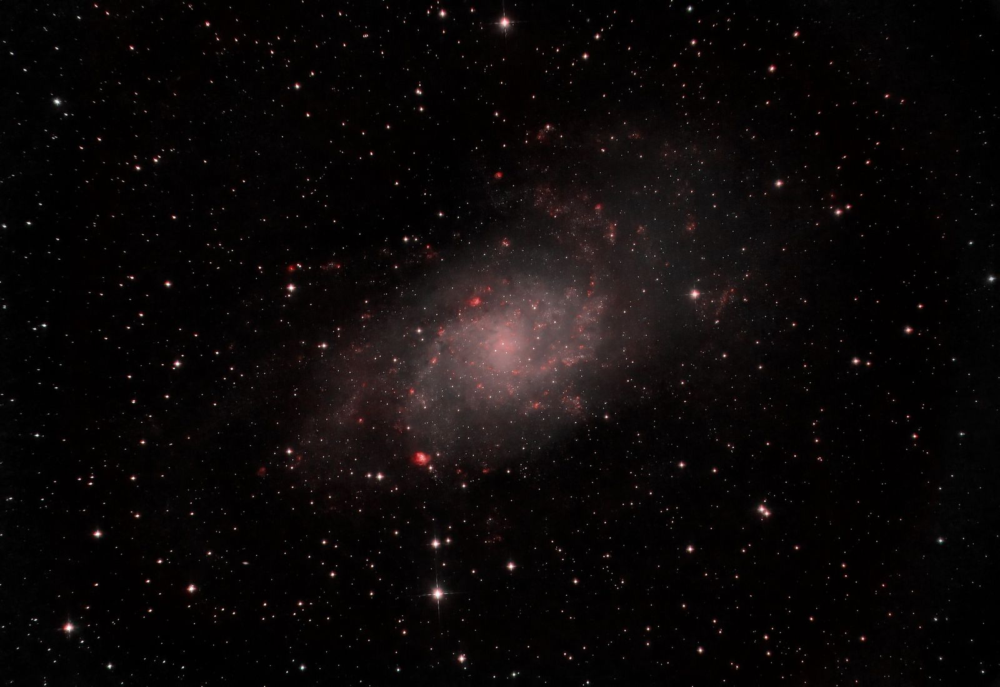
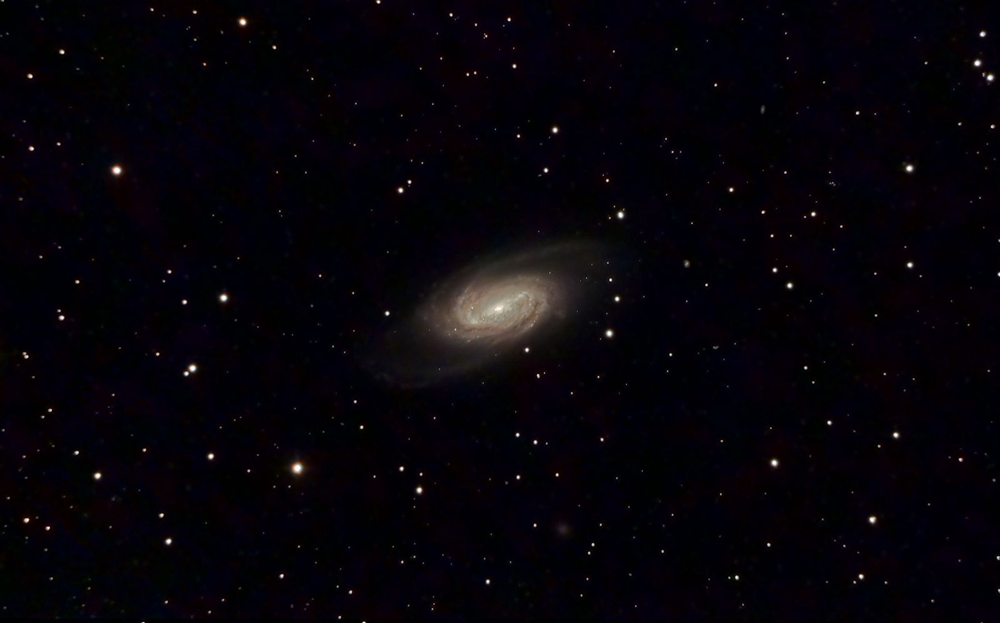

# Colorize red to IR images

Although the author does not have much experiences yet, he has tried the following two methods.

## Compositing with images using the H-alpha filter

This method uses H-alpha emission lines in the red band, which is also less light polluted, to colorize the HII region to make it stand out.
Here is an example of M33.

## Compositing with a low-resolution color image

This one uses normal color images ( captured by a one-shot color camera is fine) as RGB channels, and red to IR images as L channels.
However, since it is difficult to obtain high-resolution images in light-polluted areas, capturing a large number of binned, low-resolution images would allow us to gain some signal-to-noise ratio in light-polluted areas.

