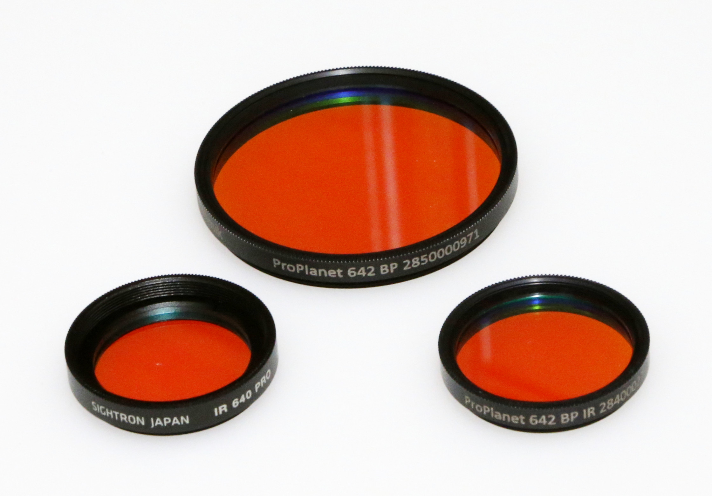

# Equipments

The key is to use a monochrome camera with sufficient QE in the red to near-infrared and an IR pass filter. Other than that, it is no different from general galaxy imaging.

The choice of a red to IR pass filter is a bit tricky, but as mentioned earlier, the author prefers filters continuously transmit light from the H-alpha band to the longer wavelengths of near-infrared.

For reference, the following is a list of cameras and filters used by the author.

## Monochrome CMOS imagers
* ZWO [ASI1600MM Cool](https://astronomy-imaging-camera.com/product/asi1600mm-cool)
* ZWO [ASI6200MM Pro](https://astronomy-imaging-camera.com/product/asi6200mm-pro-mono)

The monochrome CMOS image sensor used by the ASI1600MM is not a BSI type and does not have a very high QE in the NIR, but this imaging method is still applicable.

## Red to IR pass filters
* Astronomik [ProPlanet 642 BP IR-pass filter](https://www.astronomik.com/en/infrarot-passfilter-infrared-pass-filters/proplanet-642-bp-ir-passfilter.html)
* SIGHTRON Japan [IR640 PRO filter](https://www.sightron.co.jp/product/irpro_filter.html)

As red to near-infrared pass filters, the author uses the dielectric interference type filters that have recently come on the market because of their sharp characteristics and high transmittance. Another similar filter is SVBONY's [SV183 IR Pass 685nm](https://www.svbony.com/sv183-filter/), although it blocks H-alpha band.
On the other hand, the classic and cheaper dye-based IR pass filters could also be used.

## Optical Tube Assemblies

Chromatic aberration is a concern because of the use of the infrared range. Chromatic aberration is not only a concern for refracting telescopes, but also for reflecting telescopes with reducer lenses.

The OTAs used by the author is shown below for reference.

The OTA that the author mainly uses is the Celestron's [C11](https://www.celestron.com/products/c11-optical-tube-assembly-cge-dovetail), which is mostly used in combination with Starizona's [SCT Corrector LF II](https://starizona.com/collections/featured/products/starizona-sct-corrector-lf-large-format-reducer-coma-corrector) as a reducer to reduce the f-number and enlarge the image field.

Other telescopes such as the 10cm doublet ED refractor, [VIXEN's VC200L REFLECTOR](https://global.vixen.co.jp/en/product/2632_02/), and [SkyWatcher's BKP200/F800](http://skywatcher.com/product/quattro-200-st/)
 are also used depending on the target.

## Mounts

The author's imaging environment is an aluminum balcony that is not robust. Therefore, as lightweight mounts as possible are used.

As shown below, due to the short exposure time per frame, the author sometimes uses the Nexstar Evolution mount, which is an auto-tracking Alt-Az mount.

## lucky Imaging

Due to this unstable mounting environment, the author's imaging method is lucky imaging, which stacks a large number of normal images out of which images are suppressed to 15 seconds per frame at best.
SharpCapPro was used as the capture software, and its Live Stack feature was used to select and stack images on the fly.
