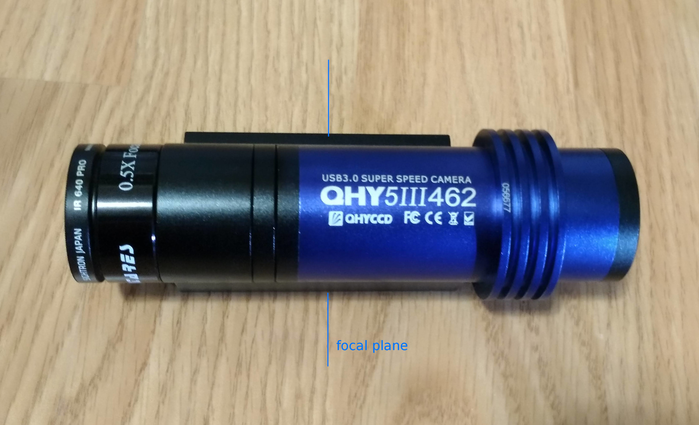

# Near IR galaxy imaging with inexpensive equipments using IMX462 camera.

## Introduction
The method of using near infrared to cancel light pollution and image galaxies basically requires an expensive large sized monochrome camera, but while looking for a less expensive way to get this effect, one good way was found. This is a report about it.

## Configuration of equipment

This image of NGC2903 was taken with a camera equipped with SONY's IMX462 image sensor. It was taken in the central area of Tokyo, which is severely light-polluted with SQM 18.17 mag./arc sec2.

The camera with the IMX462 is the [QHY5III462C](https://www.qhyccd.com/index.php?m=content&c=index&a=show&catid=133&id=61), which is designed for planetary imaging and autoguiding. It [retails for about $300](https://optcorp.com/products/qhy-5-iii-462c-color-and-nir-cmos-telescope-camera), making it one of the cheapest astronomical CMOS imagers available.

And the rest of the configuration is as follows.

* The optical tube is an entry-level 130mm F5 Newtonian (with a dedicated focuser for the 1.25" eyepiece. (It is equivalent to the [skywatcher 130P](https://www.skyatnightmagazine.com/reviews/telescopes/sky-watcher-starquest-130p-newtonian-reflector-review/)))
* SIGHTRON JAPAN's [IR640 PRO](https://www.sightron.co.jp/product/irpro_filter.html) infrared pass filter
* x0.5, 1.25" reducer (It's sold for [about $30](https://agenaastro.com/gso-1-25-0-5x-focal-reducer.html).) 

Excluding the mount, the configuration would be about $600.

The imaging conditions were as follows: exposure time was 5 seconds x 780 frames (65 minutes total), and SharpCapPro's LiveStack lucky imaging was used.

Therefore, an auto-tracking Alt-Az mount can be used for this purpose. However, due to the rotation of the field of view, the vicinity of the image will be lost.

## Description of the imaging system

The IMX462 image sensor has extremely high sensitivity in the near-infrared (around 800 nm) (the highest of all the bands), and can be used as a color camera for visible light by using an IR cut filter, or as a pseudo high-sensitivity near-infrared monochrome camera by using an IR pass filter.
In addition, the sensitivity in the near-infrared is much higher than even that of a ordinary monochrome image sensor.

### Selection of IR pass filter

As shown in the graph, the characteristics of the camera produced by the IR640 filter are not uniformly "monochrome" for the pixels of the IMX642 Bayer array, and the sensitivity of the red pixels is prominent up to about 800nm. However, considering the relationship between the spectrum of galaxies and light pollution, receiving this wavelength band seems to be a good idea.

In this way, the choice of IR pass filter is somewhat tricky. The author chose IR640 because he wanted the H-alpha to be transparent. If you don't care about that, you can use, SVBONY [IR Pass 685nm](https://www.svbony.com/sv183-filter/), Baader Planetarium [IR-Pass Filter (685nm)](https://www.baader-planetarium.com/en/baader-ir-pass-filter-(685-nm).html). Astronomik's [ProPlanet 642 BP IR-pass filter](https://www.astronomik.com/en/infrarot-passfilter-infrared-pass-filters/proplanet-642-bp-ir-passfilter.html) may also be used, but since the longer wavelengths than 842nm are cut off, the high infrared sensitivity characteristics of IMX462 may be slightly compromised.

### Use of focal reducer

The 1/3" size of the image sensor is a trade-off for the low cost, but it can be overcome by using a reducer. The reducer not only widens the field of view, but also reduces the f-number and exposure time. (In this example, the equipment used is equivalent to f/2.5.)

For more information about focal reducers, please [refer to this page.](https://agenaastro.com/articles/guides/focusers/focal-reducers-guide.html)

In addition, the QHY5III462C in particular is an "eyepiece size" camera, which increases the possibility of using the reducer with optical tubes that do not have enough back focus, such as Newtonian.

With ordinary imagers, the imaging plane (focal plane) of the imaging device can only be brought to the edge of the eyepiece sleeve. However, in this camera, the image sensor is packed in a 1.25" barrel, and the image sensor can be inserted into the focuser sleeve just like an eyepiece for ocular viewing. This makes it possible to focus in many optical tubes even when the reducer brings the focus closer to the objective.

## Side-by-side comparison

### IR640 vs No Filter
The following images show a comparison of the results with and without the IR640 filter.

The object captured is NGC1784 at Orion, and the exposure times are both 2 seconds x 52 frames using LiveStack. (104 seconds total). Stretching was done for image processing. The unfiltered image has fewer faint stars and fainter details in the galaxy.

### IR640 vs CLSCCD vs UHC
The Optlong's CLSCCD has the near-infrared band cut off. On the other hand, the UHC for ophthalmoscopy (brand unknown) seems to be transparent in the near-infrared band, as seen in this picture. Compared to these two anti-light pollution filters, the IR640 seems to be superior in combination with this imager.

## Conclusion

The camera with IMX462 was found to be suitable not only for planetary use but also for imaging galaxies in light-polluted areas. It seems that this camera can be recommended as an entry-level camera for almost all astronomical applications, including galaxies.　It will expand the scope of the astronomical hobby at the stay-home, which has been going on since 2020.
