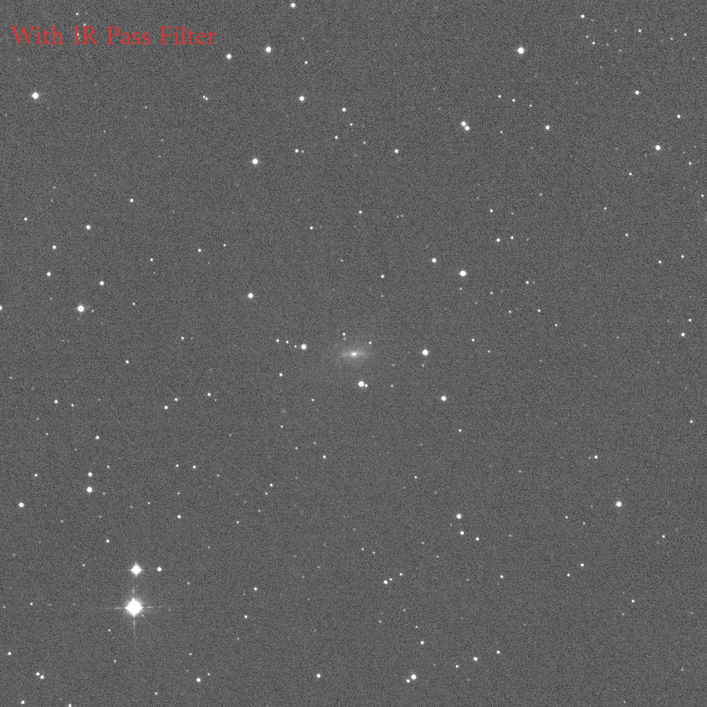
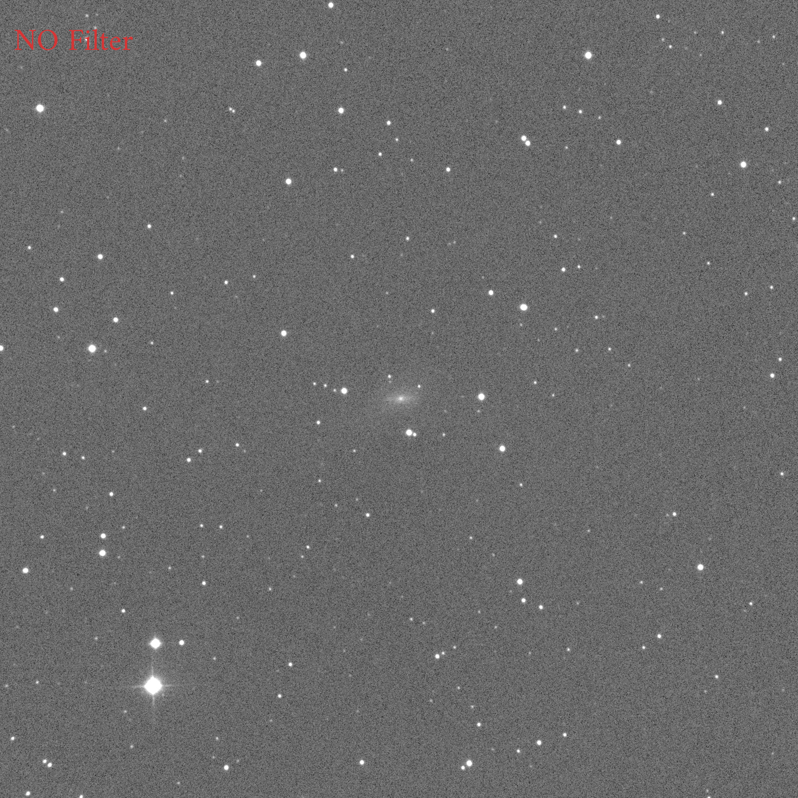
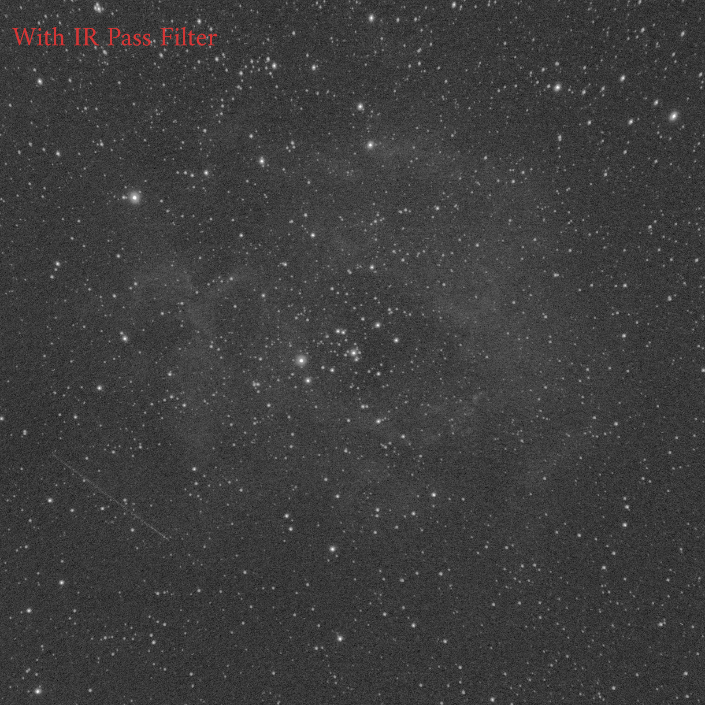
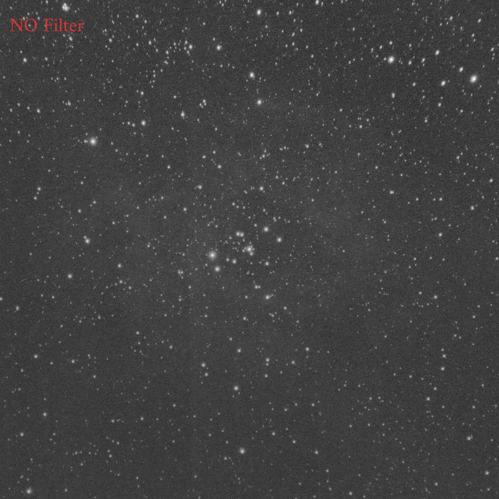

# Results
The following is a comparison of two objects imaged in a short period of time, one with the [ProPlanet 642 BP IR-pass filter](https://www.astronomik.com/en/infrarot-passfilter-infrared-pass-filters/proplanet-642-bp-ir-passfilter.html) filter and the other without. The camera used was ZWO's ASI6200MM Pro.

In the following comparison, the image without the filter is naturally much brighter in the background. So the stretching and leveling is done so that the background level and contrast are almost the same with and without the filter.

Both of these results show the improvement of the signal-to-noise ratio, which results in an increase in the number of faint stars that can be identified.In addition, the shape of the galaxy is clearer and fainter areas can be seen.
These results suggest that the use of a red to IR pass filter is valuable.

## Comparison with NGC1784　galaxy in Orion
Both are live stacked images of 5 seconds/frame x 30 frames using SharpCapPro.

## Comparison with NGC2244 in the Milky Way
Both are live stacked images of 2 seconds/frame x 30 frames using SharpCapPro.

