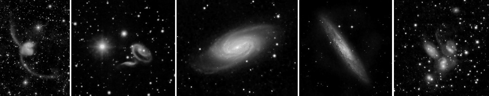

Language: <a href="https://satakagi.github.io/IR-imaging-of-galaxies-under-light-pollution/">English</a>, <a href="https://translate.google.co.jp/translate?sl=en&tl=ja&u=https%3A%2F%2Fsatakagi.github.io%2FIR-imaging-of-galaxies-under-light-pollution%2F">Japanese (Google Translation)</a>

# Red to Near-Infrared Imaging of Galaxies Under Urban Light Pollution

Satoru Takagi

  
## introduction
The author live in the center of Tokyo ([SQM 18.1](https://www.lightpollutionmap.info/#zoom=8&lat=35.67&lon=139.77&layers=B0FFFFFFTFFFFFFFFFF)), and mainly enjoy observing celestial objects at home. Therefore, overcoming light pollution is a very important issue.

It is well known that H-alpha narrow bandpass filters are very effective for imaging HII regions at light-polluted areas.
On the other hand, galaxies do not have emission line spectra like HII regions and are faint, so it has been difficult to image them under light pollution.

Using night vision with an image intensifier that has high sensitivity in the infrared region, stargazing with an infrared pass filter is known to work in light polluted areas.

So, this content will introduce the capability of imaging galaxies using red to near-infrared filters in light-polluted areas, taking the advantage of recent CMOS image sensors that have become significantly sensitive even in the near-infrared.

## [How the effect works](Basis.md)

## [Equipments](Equipments.md)

## [Results](Results.md)

## [Gallery of galaxies](ImageGallery.md)

## Appendices
* [Colorization]()
* [Application with low-cost equipments](IMX462_QHT5III462C_NIRgalaxyImaging.md)
